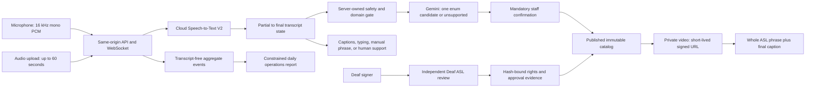

# SignBridge Reception

A captions-first, staffed front-desk communication aid that can use AI to select one bounded, human-recorded, independently Deaf-reviewed ASL phrase—only after staff confirmation.

> [!IMPORTANT]
> This repository is a **code-complete, locally tested pilot scaffold**, not yet a production deployment or a market-ready ASL product. The tracked catalog contains ten intent definitions and **zero signing assets**; playback is disabled. No signer/reviewer approval, cloud execution, customer, invoice, revenue, or Deaf-user acceptance is claimed.

> [!CAUTION]
> SignBridge Reception is not an interpreter and must not be used for emergencies, medicine, law, security, payments, identity verification, employment rights, or other consequential communication. Unsupported content stays in captions, typing, manual phrase selection, or the pilot site's established communication-support process.

## What is implemented

- A single-screen React/Vite reception interface for staff-controlled microphone capture, uploaded audio, typing, and manual phrase selection.
- Provisional and finalized English captions with restrained screen-reader announcements and persistent final captions.
- A Fastify REST/WebSocket service with runtime-validated shared TypeScript contracts.
- Final-only transcription stabilization: a partial ASR hypothesis can never create an intent candidate or signing plan.
- Deterministic language, length, domain, name/number, and high-stakes gates before model invocation.
- A Google Speech-to-Text V2 adapter and an enum-only `gemini-3.6-flash` Structured Outputs classifier with no tools.
- Mandatory staff confirmation, server-owned intent and asset IDs, catalog/hash/review/withdrawal checks, short-lived asset URLs, and captions-only failure behavior.
- Same-origin cookie sessions, size/rate/concurrency limits, privacy-safe aggregate events, an admin metrics API, and a constrained daily operations report.
- Cloud Run, Cloud Build, Firestore TTL, Cloud Scheduler, and immutable-digest production-promotion configuration.
- Local/demo provenance labels that never represent scripted fixtures as Google Cloud, Gemini, ASL, or human-reviewed output.

The model choice is documented by Google's current [`gemini-3.6-flash` model page](https://ai.google.dev/gemini-api/docs/models/gemini-3.6-flash) and [Structured Outputs guidance](https://ai.google.dev/gemini-api/docs/structured-output). A deployed pilot must still retain evidence of the exact model actually executed.

## Safety architecture



The browser never supplies candidate assets. Gemini can select only a server-defined intent or `unsupported`; its output is validated again on the server and cannot trigger playback. Every playable asset must be one complete utterance whose exact SHA-256 bytes, caption, rights record, and independent review are bound to a published catalog version.

## Run locally

### Prerequisites

- Node.js 24
- pnpm 11.18.0, preferably through Corepack
- Current Chrome or Edge for the installed-browser suites

```powershell
corepack enable
pnpm install --frozen-lockfile
pnpm dev
```

Open `http://127.0.0.1:4173`. The API listens on `http://127.0.0.1:8080`, and Vite proxies same-origin `/api` traffic during development.

Choose **Explore local demo** for the scripted, non-cloud walkthrough. To enter the local-safe staff shell, the development-only access code is `signbridge-demo`. Local-safe mode deliberately has no speech provider, Gemini execution, or playable ASL media, so those paths fall back instead of fabricating results.

Configuration defaults are defined in the API and summarized in [`.env.example`](.env.example). The application does not automatically load that file: set environment variables in the shell, secret manager, or Cloud Run configuration. Never reuse the example/default access codes or session secret in production.

## Verify the implementation

```powershell
pnpm verify
pnpm exec playwright test --project=chrome
pnpm exec playwright test --project=msedge
pnpm audit --prod --audit-level=high
```

`pnpm verify` checks LF line endings, likely committed secrets, TypeScript, unit tests, catalog invariants, and both production builds. Browser tests exercise mocked mic/WebSocket/upload/playback success and failure paths; they do not prove real provider execution or ASL comprehension.

Latest local evidence on 2026-08-01:

| Gate | Result |
| --- | --- |
| TypeScript, catalog validation, web/API production builds | Passed |
| Unit tests | 87 passed across 14 files |
| Installed Google Chrome E2E | 19 passed |
| Installed Microsoft Edge E2E | 19 passed |
| Automated accessibility | No serious or critical Axe findings in the tested route; keyboard, 320 px reflow, 200% equivalent zoom, forced colors, and reduced motion covered |
| Production dependency audit | 0 critical/high advisories; 1 moderate transitive `uuid` advisory remains in the Google Cloud Storage dependency tree |

Not yet evaluated locally: the container image (Docker was unavailable), Linux CI, real microphone hardware/provider calls, Google Cloud deployment, manual NVDA behavior, ASL media presentation, or human comprehension.

See the [public claims ledger](docs/claims-ledger.md) for what these results establish—and what they do not.

## Public API surface

All product routes are same-origin. Site and admin routes use a short-lived HttpOnly session cookie.

| Interface | Purpose |
| --- | --- |
| `POST /api/session/exchange` | Exchange a site/admin access code for a cookie session; the site ID is server-owned |
| `WS /api/live-transcription` | Receive configuration then binary PCM; emit partial, final, candidate, fallback, error, and speech-end events |
| `POST /api/audio/transcribe` | Validate and transcribe WAV, MP3, or WebM up to 10 MB and 60 seconds through the same finalization/classification pipeline |
| `POST /api/utterances/:id/decision` | Consume one pending candidate as `play` or `fallback`; verify the current catalog before returning any asset URL |
| `GET /api/catalog` | Return public intent descriptions, availability, language pack, and catalog version—never private rights/storage records |
| `POST /api/playback-events` | Accept authorized start/completion/failure evidence for a server-issued playback grant |
| `POST /api/feedback` | Accept predefined category and severity without transcript or unrestricted free text |
| `GET /api/admin/metrics` | Return protected aggregate usage, latency, fallback, rejection, playback, and operations-job metrics |
| `GET /api/health` | Report runtime mode, service/revision/SHA, configured models, catalog version, and playback state |
| `POST /api/internal/operations/daily` | OIDC-protected aggregate operations analysis; cannot publish content, contact customers, or change the catalog |

The schemas live in [`packages/contracts`](packages/contracts), and the behavior is covered by unit/integration tests under [`tests`](tests) and package-local test files.

## Content publication gate

The ten bounded reception intents are declared in [`content/catalog/catalog.v1.draft.json`](content/catalog/catalog.v1.draft.json). This draft is intentionally non-playable.

Before changing any catalog to `published`, humans must:

1. Lock the exact intent meaning with the pilot customer, Deaf signer, and independent Deaf ASL reviewer.
2. Obtain compensation, consent, commercial hosting, contest/judge, and applicable publicity rights.
3. Record complete 1080p/30 fps utterances with face, torso, hands, and signing space visible; never crop, mirror, splice, or synthesize them.
4. Bind reviewer approval and rights references to each exact file hash and catalog version outside Git.
5. Upload immutable private objects, verify their generations and hashes, and pass `pnpm catalog:verify`.
6. Publish through a named human release authority. Corrections create new versions; withdrawal immediately blocks new signed URLs while preserving the audit trail.

Follow [content and rights](docs/content-and-rights.md), the [recording guide](docs/recording-guide.md), and the [linguistic safety contract](docs/linguistic-safety.md). Engineering does not author or approve ASL translations.

## Cloud deployment

[`infra/cloudbuild.yaml`](infra/cloudbuild.yaml) builds and verifies an exact commit before deploying the staging service. The current pilot configuration intentionally caps Cloud Run at **one instance** because confirmation, playback-grant, and live-concurrency state are process-local. Do not raise the cap until those controls use transactional distributed state and pass restart/failover tests.

The deployment operator must create the Google Cloud project, billing controls, least-privilege service accounts, private bucket, Firestore database/TTL policy, secrets, custom origin, and scheduler identity. Rehearse the exact revision and catalog in staging, then use [`infra/promote-production.ps1`](infra/promote-production.ps1) with an immutable image digest and verified commit SHA. Full prerequisites are in [`infra/README.md`](infra/README.md).

## Repository map

```text
apps/web/                React/Vite reception interface
packages/contracts/      Shared Zod contracts, intents, catalog, safety rules
services/api/            Fastify REST/WebSocket service and Google adapters
content/catalog/         Versioned, currently non-playable phrase catalog
tests/                   Cross-package unit/integration and Playwright tests
infra/                   Container, Cloud Build, TTL, scheduler, promotion scripts
docs/                    Safety, rights, accessibility, evaluation, pilot, operations
scripts/                 Catalog, line-ending, and secret-pattern release checks
```

## Pilot and submission evidence

- [`docs/release-checklist.md`](docs/release-checklist.md) is the authoritative launch gate.
- [`docs/evaluation-plan.md`](docs/evaluation-plan.md) defines the gold-audio and quantitative acceptance plan.
- [`docs/accessibility.md`](docs/accessibility.md) separates automation from manual assistive-technology and Deaf-user acceptance.
- [`docs/privacy-security.md`](docs/privacy-security.md) documents data boundaries and deployment checks.
- [`docs/pilot-runbook.md`](docs/pilot-runbook.md) and [`docs/operations-runbook.md`](docs/operations-runbook.md) cover staff operation and incident fallback.
- [`docs/pilot-evidence-kit.md`](docs/pilot-evidence-kit.md) identifies consent-safe customer, payment, cost, model-execution, and results evidence.
- [`DEVPOST_SUBMISSION.md`](DEVPOST_SUBMISSION.md) is a copy-ready evidence template with required fields, not a completed submission.
- [`CODEX_USAGE.md`](CODEX_USAGE.md) records what Codex did and did not do.

The default pilot offer is **$500 setup and validation plus $99 per location per month**, invoiced outside the application. It is a proposed price—not evidence of a sale. Do not claim a paid pilot, production AI, linguistic approval, customer impact, or market readiness until the corresponding retained evidence closes the checklist.

## Provenance

This is a new repository. [`PREEXISTING_ASSETS.md`](PREEXISTING_ASSETS.md) records the selective conceptual reuse from Apache-2.0-licensed [`Omarzaf/signbridge-overlay`](https://github.com/Omarzaf/signbridge-overlay) at commit `0f68661a705068f0f9cfd79f437f435cc723bdf6`. No upstream authoring service, synthetic PWA, extension, deterministic gloss matcher, video-sync engine, signing corpus, media, or reviewer approval was imported.
