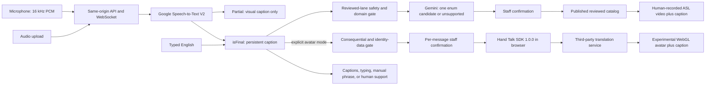

# SignBridge Reception

A captions-first, staffed front-desk communication aid with two clearly separated signing lanes: a bounded human-recorded phrase catalog intended for production review, and an opt-in experimental Hand Talk WebGL avatar.

> [!IMPORTANT]
> This repository is a locally implemented hybrid prototype, not a production deployment or an unrestricted English-to-ASL interpreter. The reviewed catalog defines ten intents but contains **zero approved signing assets**, so reviewed playback is disabled. No Hand Talk token, Google Application Default Credentials, real Speech-to-Text result, Vertex/Gemini response, or provider-rendered avatar has yet been tested.

> [!CAUTION]
> The experimental avatar may be wrong and is not certified interpretation. Do not use SignBridge for emergencies, medicine, law, security, payments, identity verification, employment rights, or other consequential communication. Keep the finalized English caption visible and use the site's qualified communication-support process.

## Two lanes, two assurance levels

| Lane | Intended use | What it does | Current status |
| --- | --- | --- | --- |
| Reviewed phrase catalog | Production-target bounded reception messages | Final Google STT text → deterministic gate → one Gemini enum candidate or `unsupported` → staff confirmation → one complete human-recorded, independently Deaf-reviewed asset | Code-complete scaffold; playback blocked because no approved media, rights, or review exists |
| Hand Talk avatar | Opt-in open-input evaluation | Final speech/upload transcript or explicitly submitted English → deterministic consequential/name/number gate → per-message staff confirmation → Hand Talk for Devs JavaScript SDK 1.0.0 → WebGL synthetic ASL avatar | Integration code present; no contracted token, provider execution, DPA, or independent Deaf evaluation |

The experimental lane does not inherit the reviewed lane's linguistic assurance. A successful animation is not evidence that its meaning is correct. Captions-only mode makes no avatar request.

The [World Federation of the Deaf and World Association of Sign Language Interpreters statement on signing avatars](https://wfdeaf.org/wp-content/uploads/WFD-and-WASLI-Statement-on-Avatar-FINAL-14032018-Updated-14042018.pdf) explains why word-for-sign substitution cannot represent signed-language grammar and warns against replacing qualified interpreters with avatars for live, complex, or important communication.

## What is implemented

- A React/Vite reception interface for staff-controlled microphone capture, uploaded audio, typing, manual phrase selection, captions-only use, and opt-in avatar presentation.
- Provisional and finalized English captions with restrained screen-reader announcements and persistent final captions.
- A Fastify REST/WebSocket service with runtime-validated shared TypeScript contracts.
- Final-only speech stabilization: a partial ASR hypothesis can update the provisional caption but cannot create a reviewed intent or Hand Talk request.
- Google Speech-to-Text V2, Vertex/Gemini Structured Outputs, private Cloud Storage, and Firestore adapters behind `USE_GOOGLE_CLOUD=true`.
- A reviewed-lane deterministic language, length, domain, name/number, and consequential-use gate before the enum-only model call.
- Mandatory staff confirmation, server-owned intent/asset IDs, catalog/hash/review/withdrawal checks, short-lived asset URLs, and captions-only failure behavior for reviewed media.
- Authenticated avatar configuration, server authorization, and transcript-free execution-event routes plus a pinned Hand Talk 1.0.0 browser integration supporting `HUGO` or `MAYA`, ASL (`en-ase`), pause, resume, repeat, stop, and speed controls.
- Same-origin cookie sessions, body/rate/concurrency limits, restrictive headers, privacy-safe aggregate events, an admin metrics API, and a constrained daily operations report.
- Local/demo provenance labels that never represent fixtures as Google Cloud, Hand Talk, ASL, or human-reviewed output.

## Architecture



The reviewed path remains the production-safe target. In the experimental path, SignBridge authorizes only finalized or explicitly submitted text after a deterministic consequential/name/number gate and an explicit staff decision. The authenticated browser then receives the public-client vendor token and sends the authorized text to Hand Talk. SignBridge does not inspect or approve the generated linguistic output. See [architecture](docs/architecture.md), [linguistic safety](docs/linguistic-safety.md), and [privacy/security](docs/privacy-security.md).

## Run locally

### Prerequisites

- Node.js 24
- pnpm 11.18.0, preferably through Corepack
- Current Chrome or Edge; WebGL is additionally required for the vendor avatar

```powershell
corepack enable
pnpm install --frozen-lockfile
pnpm dev
```

Open `http://127.0.0.1:4173`. The API listens on `http://127.0.0.1:8080`, and Vite proxies same-origin `/api` traffic during development.

Choose **Explore local demo** for the scripted, non-cloud walkthrough. The development-only access code is `signbridge-demo`. Local-safe mode has no speech provider, Gemini execution, reviewed ASL media, or Hand Talk provider output and must not be represented otherwise.

The application does not automatically load `.env.example`. Set environment variables in the shell, Secret Manager/Cloud Run configuration, or another approved runtime mechanism. Never use the example access codes or session secret in production.

## Exact provider configuration

### Google Cloud lane

Set:

```text
USE_GOOGLE_CLOUD=true
GOOGLE_CLOUD_PROJECT=<project-id>
GOOGLE_CLOUD_LOCATION=<Vertex location, currently defaulting to global>
GOOGLE_SPEECH_LOCATION=<recognizer location, defaulting to us for chirp_3>
GOOGLE_SPEECH_RECOGNIZER=<recognizer ID or _>
GOOGLE_SPEECH_MODEL=<deployed model, currently configured as chirp_3>
GEMINI_MODEL=<Vertex publisher model available in that project/location>
SIGN_ASSET_BUCKET=<private bucket name>
FIRESTORE_DATABASE=<database ID>
```

`GOOGLE_CLOUD_PROJECT` and `SIGN_ASSET_BUCKET` are mandatory when cloud mode is enabled. Google client libraries use Application Default Credentials:

- on Cloud Run, attach a least-privilege service account with only the required Speech-to-Text, Vertex AI, bucket-signing/read, and Firestore permissions;
- for an authorized local smoke test, use native Windows user ADC from `gcloud auth application-default login`; do not create a service-account key for this workflow.

Native Windows setup and the regional Chirp 3 smoke-test evidence steps are documented in [`docs/google-cloud-windows-setup.md`](docs/google-cloud-windows-setup.md). The Linux `setup_adc.sh` sample is not the correct bootstrap for this native Windows process.

Do not paste access tokens or service-account JSON into this repository. The default `GEMINI_MODEL=gemini-3.6-flash` is a configuration value, not proof that the model is available through Vertex in the chosen project/location. Confirm it with an authorized minimal request before deployment.

### Experimental Hand Talk lane

Set:

```text
HANDTALK_TOKEN=<contracted fixed-channel browser SDK token>
HANDTALK_SDK_URL=https://api-cdn.handtalk.me/sdk/1.0.0/ht-api-sdk.min.js
HANDTALK_AVATAR=HUGO
```

`HANDTALK_AVATAR` may be `HUGO` or `MAYA`. The code accepts only an official, fixed semantic-version HTTPS SDK URL and uses `enUS` input with ASL `en-ase`, limited to 1,000 characters. Hand Talk's official [quick start](https://api-docs.handtalk.me/v1/en/javascript/getting-start) documents token-based browser initialization and `translate()`. Its [release-channel guide](https://api-docs.handtalk.me/v1/en/javascript/release-channels) says fixed versions avoid forced updates and that beta and fixed/latest channels use different tokens. The [SDK introduction](https://api-docs.handtalk.me/beta/en/introduction) documents WebGL and input-length limits.

When configured, the API returns the Hand Talk token to the authenticated browser with `Cache-Control: no-store`, because the vendor SDK requires a client-side token. Treat it as a public-client credential: require exact-origin restrictions, separate staging/production tokens, quotas, rotation, revocation, and monitoring. It must never double as a server or administrative credential.

Do not enter pilot/customer text until Hand Talk supplies executed commercial terms for this use, SDK/token scope, allowed origins, contest/customer rights, an SDK-specific DPA, retention/deletion and subprocessors, hosting regions, incident response, SLA/support, and token revocation. No such agreement is included in this repository.

## Verification

```powershell
pnpm verify
pnpm exec playwright test --project=chrome
pnpm exec playwright test --project=msedge
pnpm audit --prod --audit-level=high
```

`pnpm verify` checks line endings, likely committed secrets, TypeScript, unit tests, catalog invariants, and production builds. Browser tests use controlled providers; they cannot establish ASL accuracy or real provider execution.

The last recorded baseline on 2026-08-01—before the experimental Hand Talk working-tree changes—passed TypeScript, 87 unit tests, catalog validation, both builds, 19 Chrome E2E checks, and 19 Edge E2E checks. It found no serious or critical Axe issue in the tested route and no critical/high production dependency advisory; one moderate transitive `uuid` advisory remained in the Google Cloud Storage tree. Those results must not be reported as validation of the final hybrid build until the suites are rerun.

Still unverified: a real Hand Talk token and generated output, Google ADC, live Speech-to-Text/Gemini calls, deployed cloud revision, real microphone hardware, container build, Linux CI, manual NVDA behavior, reviewed ASL presentation, provider privacy behavior, commercial rights, and Deaf-user comprehension. The [claims ledger](docs/claims-ledger.md) is authoritative.

## Public API

All product routes are same-origin. Site/admin routes use a short-lived HttpOnly session cookie.

| Interface | Purpose |
| --- | --- |
| `POST /api/session/exchange` | Exchange a site/admin access code for a cookie session |
| `GET /api/avatar/config` | Return no-store experimental avatar configuration after site authentication; returns no token when disabled |
| `POST /api/avatar/drafts` | Safety-gate and normalize a finalized message into a session-bound, five-minute server draft without contacting the provider |
| `POST /api/avatar/drafts/:draftId/decision` | Consume the canonical draft once as `play` or `fallback`; the decision request cannot replace its text |
| `POST /api/avatar/events` | Record structured start/completion/failure evidence without transcript text |
| `WS /api/live-transcription` | Receive PCM and emit partial, final, reviewed candidate, fallback, error, and speech-end events |
| `POST /api/audio/transcribe` | Validate/transcribe WAV, MP3, or WebM up to 10 MB and 60 seconds |
| `POST /api/utterances/:id/decision` | Confirm or reject one reviewed-lane candidate and verify the published catalog |
| `GET /api/catalog` | Return public intent descriptions and availability, never private rights/storage records |
| `POST /api/playback-events` | Accept authorized reviewed-media playback evidence |
| `POST /api/feedback` | Accept predefined category/severity without transcript or free text |
| `GET /api/admin/metrics` | Return protected aggregate operational metrics |
| `GET /api/health` | Report runtime, revision, configured Google model strings, catalog, and playback state |
| `POST /api/internal/operations/daily` | OIDC-protected aggregate analysis that cannot publish content or contact customers |

Hand Talk translation calls do not pass through a SignBridge server route; the browser SDK communicates with the vendor after configuration.

## Content publication gate

The ten bounded reception intents in [`content/catalog/catalog.v1.draft.json`](content/catalog/catalog.v1.draft.json) are intentionally non-playable. Before publishing reviewed media, humans must:

1. Lock each exact meaning with the pilot customer, Deaf signer, and independent Deaf ASL reviewer.
2. Obtain compensation, consent, commercial hosting, contest/judge, and applicable publicity rights.
3. Record complete 1080p/30 fps utterances with face, torso, hands, and signing space visible; never crop, mirror, splice, or synthesize them.
4. Bind reviewer approval and rights references to each exact SHA-256 file and catalog version outside Git.
5. Upload immutable private objects, verify generations and hashes, and pass `pnpm catalog:verify`.
6. Publish through a named human authority; corrections create new versions and withdrawal blocks new signed URLs.

Engineering does not author or approve ASL translations. These guarantees apply only to reviewed catalog assets, never to Hand Talk output.

## Experimental-lane release blockers

Before enabling the avatar for any market pilot:

- close the vendor contract, DPA, retention, subprocessor, region, SLA, origin, quota, rotation, and revocation questions;
- execute a real staging smoke test with the fixed token/SDK and record network, error, latency, and control behavior;
- commission independent compensated Deaf ASL experts and users to evaluate the exact provider version/avatar on unseen inputs;
- retain captions and an immediate human-support route;
- exclude all consequential use even if average evaluation results appear strong;
- publish only bounded, measured findings—never “unrestricted accurate interpretation.”

The [evaluation plan](docs/evaluation-plan.md) defines separate gates for reviewed and experimental output.

## Cloud deployment

[`infra/cloudbuild.yaml`](infra/cloudbuild.yaml) builds and verifies an exact commit before staging deployment. The pilot remains capped at one Cloud Run instance because confirmation, playback-grant, and live-concurrency state are process-local. Do not raise the cap until those controls use transactional distributed state and pass restart/failover tests.

The operator must configure billing alerts, least-privilege service identities, private storage, Firestore/TTL, secrets, custom origin, scheduler identity, Hand Talk origin restrictions, and separate provider credentials. Rehearse the exact code revision, catalog, Google models, and Hand Talk SDK/token channel in staging. See [`infra/README.md`](infra/README.md).

## Repository map

```text
apps/web/                React/Vite interface and Hand Talk WebGL host
packages/contracts/      Shared Zod contracts, catalog, safety, avatar config
services/api/            Fastify REST/WebSocket service and Google adapters
content/catalog/         Versioned, currently non-playable phrase catalog
tests/                   Cross-package and Playwright tests
infra/                   Container, Cloud Build, TTL, scheduler, promotion
docs/                    Safety, rights, privacy, evaluation, pilot, operations
scripts/                 Catalog, line-ending, and secret-pattern checks
```

## Evidence and provenance

- [`docs/release-checklist.md`](docs/release-checklist.md) is the existing launch gate and must be reconciled with the newer hybrid boundary before launch.
- [`docs/evaluation-plan.md`](docs/evaluation-plan.md) separates reviewed and experimental acceptance.
- [`docs/privacy-security.md`](docs/privacy-security.md) documents Google and Hand Talk data/credential boundaries.
- [`docs/avatar-provider-decision.md`](docs/avatar-provider-decision.md) records the provider and cost decision with its unresolved commercial and human-review gates.
- [`docs/google-cloud-windows-setup.md`](docs/google-cloud-windows-setup.md) gives the native Windows ADC and regional Speech setup path.
- [`docs/claims-ledger.md`](docs/claims-ledger.md) states what may be claimed today.
- [`CODEX_USAGE.md`](CODEX_USAGE.md) records Codex's actual role and non-actions.
- [`DEVPOST_SUBMISSION.md`](DEVPOST_SUBMISSION.md) remains an evidence template, not a completed submission.

The proposed price of $500 setup/validation plus $99 per location per month is not evidence of a sale. Do not claim a paid pilot, production AI, linguistic approval, customer impact, or market readiness without retained proof.

This is a new repository. [`PREEXISTING_ASSETS.md`](PREEXISTING_ASSETS.md) records selective conceptual reuse from Apache-2.0-licensed [`Omarzaf/signbridge-overlay`](https://github.com/Omarzaf/signbridge-overlay) at commit `0f68661a705068f0f9cfd79f437f435cc723bdf6`. No upstream signing corpus, media, reviewer approval, authoring service, extension, deterministic gloss matcher, or video-sync engine was imported.
