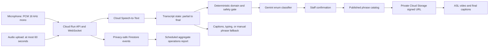

# Architecture

SignBridge Reception is a bounded communication aid for a staffed front desk. It does not translate unrestricted English into ASL. It transcribes one short English utterance, asks Gemini to select one server-owned reception intent or abstain, requires staff confirmation, and then retrieves one whole-utterance video whose exact bytes were approved by an independent Deaf ASL reviewer.

## Trust boundaries

- Browser audio, uploads, transcripts, cookies, and model output are untrusted.
- Only the server owns the intent catalog and maps intents to assets.
- Partial transcripts can update the visual caption surface but cannot create an intent or sign plan.
- Model output is a candidate, never publication or linguistic authority.
- Every supported candidate requires staff confirmation.
- Only a published catalog with hash-bound rights and reviewer evidence can issue an asset URL.
- Raw audio and transcript text stay in process memory and are excluded from operational events.

## Runtime modes

- `local`: deterministic fixtures exercise the interface and failure states. They are never described as Gemini, Cloud Speech-to-Text, ASL, or human-reviewed output.
- `cloud`: Cloud Speech-to-Text, Gemini, Cloud Storage, and Firestore adapters use workload identity or server-side credentials.

The application must expose its active mode in health and diagnostic data so local demonstrations cannot be counted as production AI evidence.
