# Architecture

SignBridge Reception now contains two deliberately separate signing lanes. They do not have the same assurance level.

1. **Reviewed phrase lane — production target.** Finalized English speech is checked by deterministic safety rules, classified into one of ten server-owned reception intents or `unsupported`, confirmed by staff, and resolved to one complete human-recorded asset. Playback remains disabled until every exact file is covered by rights and independent Deaf ASL review.
2. **Hand Talk avatar lane — opt-in experiment.** Finalized English speech, a finalized upload transcript, typed text, or a selected English phrase can be sent by the authenticated browser to the Hand Talk for Devs JavaScript SDK 1.0.0. The SDK renders a synthetic ASL avatar with WebGL. This output is not independently reviewed, is not certified interpretation, and is not established as accurate for unrestricted input.

English captions remain visible in both lanes. Captions-only mode makes no avatar request.

```mermaid
flowchart LR
  mic["Microphone: PCM 16 kHz mono"] --> api["Same-origin Cloud Run API and WebSocket"]
  upload["Audio upload: at most 60 seconds"] --> api
  api --> stt["Google Speech-to-Text V2"]
  stt --> state["Partial and final transcript state"]
  state -->|"partial: display only"| caption["Provisional English caption"]
  state -->|"isFinal only"| final["Persistent finalized English caption"]
  typed["Typed English"] --> final

  final --> reviewedGate["Domain and consequential-use gate"]
  reviewedGate --> gemini["Gemini enum candidate or unsupported"]
  gemini --> confirm["Mandatory staff confirmation"]
  confirm --> catalog["Published immutable phrase catalog"]
  catalog --> storage["Private human-recorded asset"]
  storage --> reviewedOutput["Reviewed whole-utterance ASL video plus caption"]

  final -->|"explicit avatar mode"| avatarGate["Consequential, injection, name, and number gate"]
  avatarGate --> avatarConfirm["Per-message staff confirmation"]
  avatarConfirm -->|"configured token"| browserSdk["Hand Talk SDK 1.0.0 in browser"]
  browserSdk --> vendor["Hand Talk translation service"]
  vendor --> avatar["Experimental WebGL avatar plus caption"]

  final --> fallback["Captions, typing, manual phrase, or human support"]
  api --> events["Transcript-free aggregate events"]
```

The browser AudioWorklet downmixes input to mono, performs continuous area-weighted
resampling from the hardware rate (including 44.1 and 48 kHz) to 16 kHz, and sends
40 ms LINEAR16 frames (640 samples / 1,280 bytes). The worklet accepts an explicit
`flush` control message that emits the final short frame; full frames are never padded.
On push-to-talk release, the browser waits for the worklet's flush acknowledgement
before sending `audio.stop`, so the last partial frame reaches the speech socket first.

## Final-only speech rule

Google Speech-to-Text V2 interim results may change. A partial result may update only the provisional caption. The reviewed lane may classify only a final result; the captions-only and avatar lanes explicitly skip that classifier, while the avatar lane may queue only text delivered in an `isFinal` event. Releasing push-to-talk waits up to 1.2 seconds for a final result; without one, the provisional text is discarded and no avatar request is made.

Uploaded audio is transcribed server-side and only the finalized returned transcript is eligible for either lane. Typed input is already explicit text and does not pass through Speech-to-Text.

## Experimental avatar boundary

The server exposes `GET /api/avatar/config` only after site authentication and marks the response `Cache-Control: no-store`. If `HANDTALK_TOKEN` is present, the response contains the token, pinned SDK URL, `HUGO` or `MAYA`, `enUS`, `en-ase`, and the 1,000-character limit. Captions-only is the default; choosing avatar mode alone does not load the SDK. For each finalized or explicitly submitted message, staff must confirm a pending request, and `POST /api/avatar/authorize` applies the deterministic consequential, prompt-injection, name, and number gate. Only an allowed response may mount the third-party script and call `HTApi.translate()`. Structured client-observed start/completion/failure events go to `POST /api/avatar/events` without transcript text; they support troubleshooting but are not proof of vendor execution. Therefore:

- the token is a browser-delivered vendor credential, not a server-only secret;
- only server-authorized, staff-confirmed final or explicit English text leaves SignBridge and is processed by Hand Talk;
- the application does not proxy, inspect, or retain the provider's generated motion;
- provider availability, translation behavior, telemetry, retention, and deletion cannot be inferred from local mocks;
- configuration must remain disabled until an authorized commercial token, origin restrictions, rotation procedure, contract, privacy terms, DPA, and incident process are documented.

The official [Hand Talk quick start](https://api-docs.handtalk.me/v1/en/javascript/getting-start) documents the browser token and `HTApi.translate()` flow. Its [release-channel guidance](https://api-docs.handtalk.me/v1/en/javascript/release-channels) describes fixed `1.0.0` URLs and warns that tokens differ between beta and fixed/latest channels. The [SDK introduction](https://api-docs.handtalk.me/beta/en/introduction) documents the current WebGL-only and 1,000-character constraints.

## Reviewed phrase trust boundary

- Browser audio, uploads, transcript text, cookies, and model output are untrusted.
- Only the server owns the reviewed intent catalog and maps intents to assets.
- Model output is a candidate, never publication or linguistic authority.
- Every supported candidate requires staff confirmation.
- Only a published catalog with hash-bound rights and independent reviewer evidence can issue an asset URL.
- Raw audio and transcript text stay in process memory and are excluded from operational events.

The avatar lane does not inherit these reviewed-asset guarantees. Selecting avatar mode is not equivalent to staff validation of the signed result.

## Runtime and credentials

- `local-safe`: no real speech, Gemini, Cloud Storage, Firestore, or avatar output is claimed. With a blank `HANDTALK_TOKEN`, the avatar is unavailable and the application falls back to captions or the reviewed phrase flow.
- `google-cloud`: set `USE_GOOGLE_CLOUD=true`, `GOOGLE_CLOUD_PROJECT`, `SIGN_ASSET_BUCKET`, and the Google location/model/recognizer variables from `.env.example`. Google client libraries use Application Default Credentials. Use an attached least-privilege Cloud Run service account in deployment; for authorized local smoke testing, use `gcloud auth application-default login` or a narrowly scoped `GOOGLE_APPLICATION_CREDENTIALS` file outside Git.
- `handtalk-experimental`: set an authorized fixed-channel `HANDTALK_TOKEN`; retain the pinned `HANDTALK_SDK_URL=https://api-cdn.handtalk.me/sdk/1.0.0/ht-api-sdk.min.js`; optionally select `HANDTALK_AVATAR=HUGO` or `MAYA`. A token issued for another release channel may not work.

As of 2026-08-02, no Hand Talk token, Google ADC identity, live Speech-to-Text result, Vertex/Gemini response, or provider-rendered avatar output has been exercised in this repository. Configuration code and mocks are not production-execution evidence.

## Product boundary

The [WFD/WASLI statement on signing avatars](https://wfdeaf.org/wp-content/uploads/WFD-and-WASLI-Statement-on-Avatar-FINAL-14032018-Updated-14042018.pdf) warns that word-for-sign substitution cannot represent signed-language grammar and that avatars should not replace qualified interpreters for live, complex, or important communication. The reviewed phrase lane remains the production-safe target. The open-input avatar is an evaluation surface only and stays out of emergencies, medicine, law, security, payments, identity verification, employment rights, and other consequential communication.
